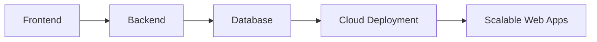

<h1 align="center">
  
</h1>

<h3 align="center">
🌐 Full Stack Web Developer | ⚛️ React Enthusiast | 🚀 Modern UI/UX Builder
</h3>

<p align="center">
  
</p>

---


# 💻 About Me

```yaml
Name: Rakesh K

Role:
  - Full Stack Web Developer
  - React Developer

Specialization:
  - Frontend Development
  - Backend Development
  - Responsive Web Design
  - Scalable Web Applications

Currently Learning:
  - Node.js
  - Advanced React
  - Cloud Computing
  - Scalable Architecture

Currently Working On:
  - Faculty Appraisal System

Passionate About:
  - Web Development
  - Clean UI/UX
  - Scalable Systems
  - Modern Technologies
```

✨ Passionate about crafting modern, scalable, and high-performance web applications.

⚡ I love building responsive interfaces, clean backend systems, and smooth user experiences.

🌱 Exploring:
- React.js
- Node.js
- Cloud Computing
- Full Stack Development
- UI/UX Design

---

# 🚀 Featured Projects

<div align="center">

<table>
<tr>
<td width="50%">

## 🏢 Faculty Appraisal System

🔹 Academic management platform

🔹 Built with scalable architecture

🔗 [View Project](https://github.com/RakeshK325)

</td>

<td width="50%">

## 💉 Vaccination Management System

🔹 Healthcare management web app

🔹 Efficient vaccination tracking system

🔗 [View Project](https://github.com/RakeshK325/Vaccination-management-System.git)

</td>
</tr>

<tr>
<td width="50%">

## ⚛️ React Web Applications

🔹 Modern React.js projects

🔹 Responsive and scalable frontend systems

</td>

<td width="50%">

## 🚀 Future Goals

🔹 Building AI-powered web applications

🔹 Creating impactful scalable systems

</td>
</tr>
</table>

</div>

---

# ⚡ Tech Stack

<p align="center">


</p>

---

# 🌐 Web Development Vision

<p align="center">
  
</p>

<div align="center">



</div>

---

# 📊 GitHub Analytics

<p align="center">


</p>

---


# 🐍 Contribution Snake

<p align="center">


</p>

---

# 🌐 Connect With Me

<p align="center">

<a href="https://linkedin.com/in/rakesh-k325" target="_blank">

</a>

<a href="https://instagram.com/ohh.itzz__rakesh" target="_blank">

</a>

<a href="https://kaggle.com/rakeshk32" target="_blank">

</a>

<a href="mailto:rakesh160982@gmail.com">

</a>

</p>

---

# 💡 Developer Philosophy

<div align="center">

### 🚀 “Building fast, scalable, and user-friendly web experiences with modern technologies.”

</div>

---

# 📈 Profile Views

<p align="center">


</p>

---

# ⚡ Random Dev Quote

<p align="center">


</p>

---

<p align="center">


</p>
